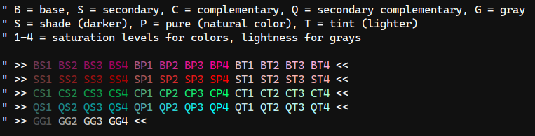

# vim-colorwheel

This plugin generates color schemes for Vim based on the [tetradic color harmony.](https://www.tigercolor.com/color-lab/color-theory/color-theory-intro.htm). This is a proof-of-concept developed to play-test a [color naming patch for vim9.](https://github.com/dvogel/vim/tree/namecolor-dict-full) **It will not work with stock vim.**

## Demo

To see this plugin in action:

0. Compile this vim fork: https://github.com/dvogel/vim/tree/namecolor-dict-full
0. Run vim from the root of this repo using the options: `vim -g -N -u /dev/null`.
0. Open `tools/tetratic_demo.vim`
0. Run `:source %`.

You should now see the top portion of the file highlighted. It should look similar to this:


This highlighting looks similar to other schemes. To see the value, scroll down the file and change this line:

```
let g:tetradic_base = [21.7, 0.79, 0.47]
```

To this line

```
let g:tetradic_base = [325.0, 0.79, 0.47]
```

And then reload the color scheme with `:source %`. Now you will see a different set of colors. It will look similar to this:



Only the first number matters (for now). You can set that value to any number between 0 and 360, with each number representing a different hue on the color wheel. The other 3 hues will be chosen automatically.

## Explanation

The dynamic color scheme is one use case for a more generic feature. For ease of demonstration, all of the code is included in this repo. In a real world scenario, the `colors/lists/tetradic.vim` could be a community-maintained color list. The `colors/lists/tetradic.vim` color scheme would be just one such color scheme based on the tetradic color list. Neither of these files would determine which colors were used to highlight the syntax.

The color list provides a set of semantically named colors that indicate how one color in the list relates to the other colors in the list. The color scheme uses those semantic names to choose relative attributes of different syntax highlight groups. The final colors are determined by the end user when they set the hue for the base color (the color from which the others are offset).

To see the semantic names generated by the tetradic list, run this command:

```
:echo filter(copy(v:colornames), { name, colstr -> name =~ 'tetradic' })
```

You will see a dictionary with 52 entries. I've reformatted that dictionary for readability below.

## The Takeaway

The overall value of this particular use case for `v:colornames` is to enable a new kind of collaboration for color schemes in vim:

* People with a deep understanding of color and human perception can contribute color lists that provide specific attributes, such as uniform contrast or colorblind-optimized hues.
* People with a deep understanding of a programming language can provide color schemes that map those semantically named colors to different syntax elements.
* End-users can benefit from this expertise while bringing their own personal preferences within the constraints imposed by the color list(s) and the color scheme(s). For this demo the base hue is under the control of the end-user.

### Example Color List

```vim
{
	\ 'tetradic_base1_pure': '#a95586', 
	\ 'tetradic_base1_shade': '#6f3858', 
	\ 'tetradic_base1_tint': '#e3c8d8', 
	\ 'tetradic_base2_pure': '#d32b8d', 
	\ 'tetradic_base2_shade': '#8b1c5d', 
	\ 'tetradic_base2_tint': '#f1bbda', 
	\ 'tetradic_base3_pure': '#e81690', 
	\ 'tetradic_base3_shade': '#990f5f', 
	\ 'tetradic_base3_tint': '#f7b4db', 
	\ 'tetradic_base4_pure': '#fc0294', 
	\ 'tetradic_base4_shade': '#a60161', 
	\ 'tetradic_base4_tint': '#feaedc', 
	\ 'tetradic_comp1_pure': '#55a978', 
	\ 'tetradic_comp1_shade': '#386f4f', 
	\ 'tetradic_comp1_tint': '#c8e3d3', 
	\ 'tetradic_comp2_pure': '#2bd371', 
	\ 'tetradic_comp2_shade': '#1c8b4a', 
	\ 'tetradic_comp2_tint': '#bbf1d1', 
	\ 'tetradic_comp3_pure': '#16e86e', 
	\ 'tetradic_comp3_shade': '#0f9948', 
	\ 'tetradic_comp3_tint': '#b4f7d0', 
	\ 'tetradic_comp4_pure': '#02fc6a', 
	\ 'tetradic_comp4_shade': '#01a646', 
	\ 'tetradic_comp4_tint': '#aefecf', 
	\ 'tetradic_comp_secondary1_pure': '#55a9a9', 
	\ 'tetradic_comp_secondary1_shade': '#386f6f'
	\ 'tetradic_comp_secondary1_tint': '#c8e3e3', 
	\ 'tetradic_comp_secondary2_pure': '#2bd3d3', 
	\ 'tetradic_comp_secondary2_shade': '#1c8b8b', 
	\ 'tetradic_comp_secondary2_tint': '#bbf1f1', 
	\ 'tetradic_comp_secondary3_pure': '#16e8e8', 
	\ 'tetradic_comp_secondary3_shade': '#0f9999', 
	\ 'tetradic_comp_secondary3_tint': '#b4f7f7', 
	\ 'tetradic_comp_secondary4_pure': '#02fcfc', 
	\ 'tetradic_comp_secondary4_shade': '#01a6a6', 
	\ 'tetradic_comp_secondary4_tint': '#aefefe', 
	\ 'tetradic_gray1': '#545454', 
	\ 'tetradic_gray2': '#a8a8a8', 
	\ 'tetradic_gray3': '#d1d1d1', 
	\ 'tetradic_gray4': '#f9f9f9', 
	\ 'tetradic_secondary1_pure': '#a95555', 
	\ 'tetradic_secondary1_shade': '#6f3838', 
	\ 'tetradic_secondary1_tint': '#e3c8c8', 
	\ 'tetradic_secondary2_pure': '#d32b2b', 
	\ 'tetradic_secondary2_shade': '#8b1c1c', 
	\ 'tetradic_secondary2_tint': '#f1bbbb', 
	\ 'tetradic_secondary3_pure': '#e81616', 
	\ 'tetradic_secondary3_shade': '#990f0f', 
	\ 'tetradic_secondary3_tint': '#f7b4b4', 
	\ 'tetradic_secondary4_pure': '#fc0202', 
	\ 'tetradic_secondary4_shade': '#a60101', 
	\ 'tetradic_secondary4_tint': '#feaeae', 
    \ }
```
